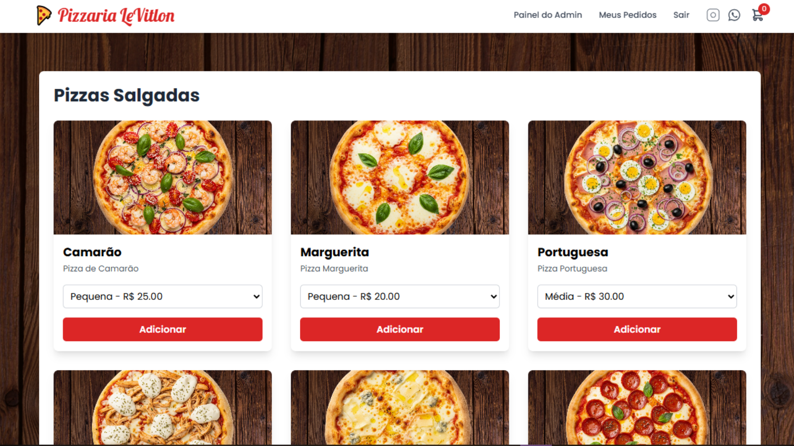
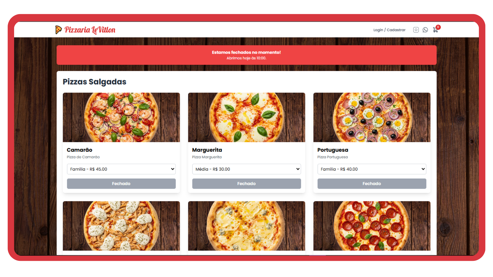
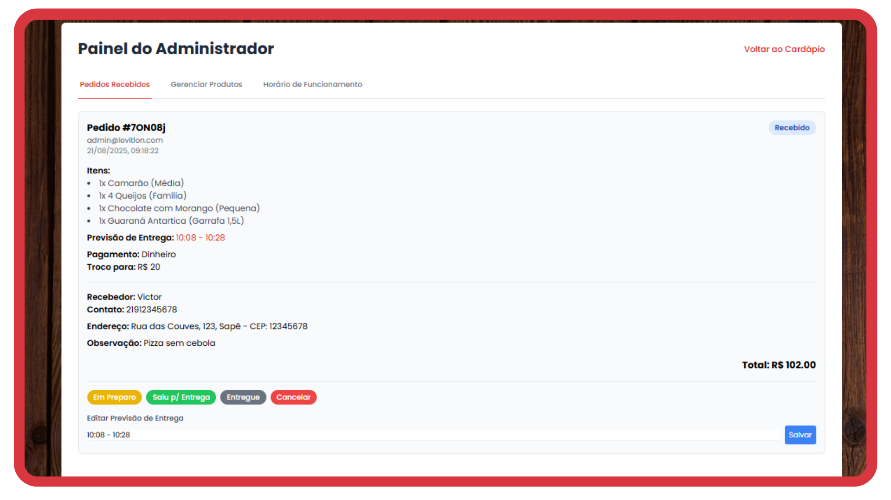
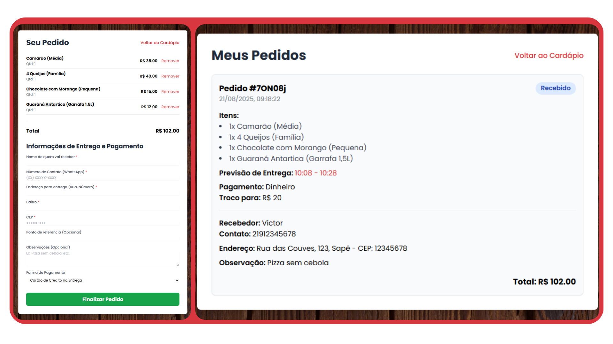

# 🍕 Pizzaria LeVitlon - Plataforma de Delivery Genérica


*Um sistema completo de delivery, do cliente ao painel do dono.*

## 📖 Apresentação do Projeto

Este é um **projeto pessoal** que desenvolvi com o objetivo principal de consolidar e colocar em prática meus conhecimentos em **HTML, CSS, JavaScript (Vanilla) e Google Firebase**.

A ideia central foi construir uma **plataforma genérica de pizzaria/restaurante** que fosse totalmente funcional, mas sem depender de frameworks pesados no frontend (como React ou Angular). Construí tudo como uma *Single Page Application (SPA)* nativa, manipulando o DOM diretamente com JS e usando o [Tailwind CSS](https://tailwindcss.com/) via CDN para uma estilização rápida e responsiva.

O grande diferencial deste projeto é que ele não é apenas uma "vitrine". Ele integra um banco de dados real e sistema de autenticação, cobrindo as duas pontas do negócio: a experiência de compra do **Cliente** e o gerenciamento da loja pelo **Administrador**.

---

## 📸 Telas do Sistema

<div align="center">
  
  
  
</div>

---

## ⚙️ Como Funciona? (Funcionalidades)

O sistema foi desenhado para atender a dois tipos de usuários, dividindo as responsabilidades de forma clara:

### 👤 Para o Cliente (Usuário Comum)
A experiência do cliente foca em facilidade e feedback visual:
* **Autenticação:** O cliente pode se cadastrar, fazer login e redefinir a senha (tudo gerido pelo Firebase Auth).
* **Cardápio em Tempo Real:** As pizzas e bebidas são divididas por categorias. Se o admin alterar um preço, atualiza na hora para o cliente.
* **Carrinho de Compras:** É possível escolher o tamanho da pizza (que altera o preço) e a quantidade. O carrinho calcula o total automaticamente.
* **Checkout e Entrega:** Formulário para dados de entrega, opções de pagamento e cálculo de troco (se for em dinheiro).
* **Meus Pedidos:** O cliente tem uma tela para acompanhar o status do seu pedido e a previsão de entrega.
* **Trava de Horário (Smart):** O sistema verifica o dia da semana e a hora atual. Se a pizzaria estiver fora do horário de funcionamento, os botões de compra são bloqueados e um aviso é exibido informando quando a loja abrirá novamente.

### 🛡️ Para o Administrador (Dono da Pizzaria)
O admin tem acesso a um painel oculto para gerir o negócio:
* **Gestão de Pedidos:** Visualiza todos os pedidos recebidos. Pode alterar o status (Em Preparo, Saiu para Entrega, Entregue) e definir manualmente uma previsão de horário para a entrega.
* **Gerenciamento de Produtos (CRUD):** Um formulário completo para o dono adicionar novas pizzas/bebidas, editar detalhes e definir múltiplos tamanhos e preços para um mesmo produto.
* **Imagens via URL:** ⚠️ *Importante:* Para simplificar o sistema e evitar custos com storage no Firebase, o cadastro de imagens dos produtos é feito **exclusivamente via URL**. O administrador deve hospedar a imagem em uma plataforma externa de sua preferência (como [ImgBB](https://imgbb.com/), Imgur, ou similar) e colar o "link direto da imagem" no momento do cadastro do produto.
* **Horário de Funcionamento:** O admin pode definir a hora de abertura e fechamento para cada dia da semana, controlando o fluxo da loja de forma dinâmica.

---

## 🛠️ Tecnologias e Ferramentas

* **Frontend:** HTML5, CSS3, JavaScript (ES6+ / Manipulação de DOM Vanilla)
* **Estilização:** Tailwind CSS
* **Fontes:** Google Fonts (Poppins e Lobster)
* **Backend (BaaS):**
  * `Firebase Authentication` (Gestão de usuários)
  * `Firebase Firestore` (Banco de dados NoSQL em tempo real)

---

## 🚀 Como testar o projeto localmente

Como o projeto foi feito com tecnologias web nativas, rodar localmente é muito simples:

1. **Clone o repositório:**

       git clone https://github.com/carlosmirandd/pizzariagenerica.git

2. **Configure o Firebase:**
   * Crie um projeto no [Firebase Console](https://console.firebase.google.com/).
   * Habilite o **Authentication** (E-mail e Senha).
   * Habilite o **Firestore Database** (configure as regras para permitir leitura/escrita).
   * Adicione as **Regras** a seguir no Firestore:
   ```cel
   rules_version = '2';
   service cloud.firestore {
    match /databases/{database}/documents {
  
    // Regra para a coleção de 'products'
    // Permite que qualquer pessoa leia os produtos.
    // Apenas usuários autenticados (o seu admin) podem criar, editar ou apagar produtos.
    match /products/{productId} {
      allow read: if true;
      allow write: if request.auth != null;
    }
    
    // Regra para a coleção de 'config'
    // Permite que qualquer pessoa leia as configurações de aparência (URL do fundo).
    // Apenas usuários autenticados (o seu admin) podem alterar as configurações.
    match /config/{docId} {
      allow read: if true;
      allow write: if request.auth != null;
    }

    // Regra para a coleção de 'orders'
    // Permite que qualquer usuário autenticado crie um pedido.
    // Apenas o dono do pedido OU o administrador podem ler ou atualizar o pedido.
    match /orders/{orderId} {
      allow create: if request.auth != null;
      allow read, update: if request.auth.uid == resource.data.userId || request.auth.token.email == "admin@levitlon.com";
     }
    }
   }
   ```
   * No arquivo `index.html`, vá até a seção do Firebase e substitua o objeto `firebaseConfig` pelas chaves da sua aplicação.

3. **Inicie o servidor:**
   * Abra o arquivo `index.html` diretamente no navegador.
   * *Ou melhor:* Use o [Live Server](https://marketplace.visualstudio.com/items?itemName=ritwickdey.LiveServer) do VS Code para rodar com *live reload*.

---

## 🔑 Acesso de Administrador

Para ver o Painel de Admin em ação, você precisa criar uma conta na plataforma usando o e-mail administrativo configurado no código.

1. Cadastre-se na sua aplicação local com o e-mail: `admin@levitlon.com`
2. Ao fazer o login com essa conta, o botão **"Painel do Admin"** será desbloqueado no menu de navegação.

---
*Feito por Carlos Miranda*
